# Agent styles lab

## What you will learn
In this lab you will learn a number of concepts including:

- **Agent syles: Default and React**
    - Similarities
    - Differences

- **How to interpret the reasoning steps**
    - For default agents
    - For react agents

- **A method to do progressive agent tuning**
    - Prototype phase
    - Debug phase
    - Reliability phase
    - Production phase

## Preface

In this lab we will be creating an agent that solves word problems with a simple set of math tools. I want to first introduce the word problem and it's solution so you know what the end result should look like if the agent solves the problem correctly. 

**Here's the word problem:**

The school carnival is in town! Four friends—Alex, Ben, Chloe, and Dana—decide to pool their money to buy some treats and play games. First, they want to play the ring toss game, which costs $1.25 per turn. They each want one turn, so they buy 4 turns. Next, they head to the snack stand. They buy one giant pretzel to share for $3.80. Alex had $15.50 in his wallet, and he used it to pay for the game turns and the pretzel. After he gets his change, the four friends decide to split the remaining amount equally so they can each buy a snow cone later. How much money does each friend receive to spend on a snow cone?

This word problem can be solved with simple addition, subtraction, multiplication, and division. 

Let's solve this puzzle piece by piece. Ask yourself these questions as you go.

**Step 1: How much did the game cost in total?**

- The problem says they bought 4 turns and the game costs $1.25 each. What operation should you use to find the total for all 4 turns?

- **Hint:** It’s repeated addition, which is multiplication!

- ***Answer:*** 4 x $1.25 = $5

**Step 2: What was the total bill?**

- Once you know the total cost of the games, don't forget they also bought a pretzel. How do you combine the game cost and the pretzel cost?

- **Hint:** You're finding a new total, so you'll add!

- ***Answer:*** $5 + $3.80 = $8.80

**Step 3: How much change did Alex get back?**

- Alex paid with $15.50, but the bill was for a smaller amount. To find the difference or the change, what do you need to do?

- **Hint:** This step involves subtraction!

- ***Answer:*** $15.50 - $8.80 = $6.70

**Step 4: How much money does each friend get?**

- This is the final question! They are going to split the change equally among 4 friends. What's the best way to share an amount equally?

- **Hint:** "Splitting equally" is the biggest clue for division!

- ***Answer:*** $6.70 / 4 = $1.675 (lowest denomination of money is cents so round down) $1.67

### Final Answer: Each person gets $1.67 for snow cones. 

Now you know how a human would solve the word problem. Let's see how an agent does it!

## Getting started

Follow these steps for the lab.

### Step 1: Load the agent's tools to solve the word problem.

We need to load the tools that the agent will use. Here are some notes about this toolkit. 

- This is an mcp toolkit that uses `fastmcp` server for implementation.
- It is a set of python functions that do math operations. 
- I've built this set of math tools to handle integer and decimal math operations.
- To simplify the lab experience we will only be using the relevant math tools in the `mcp-math.py` toolkit to solve the word problem, namely:
    - add_decimal
    - subtract_decimal
    - multiply_decimal
    - divide_decimal

PATH: 🚨 MAKE sure your terminal is in this directory `wxO_advanced_workshop/agent-styles-lab` so the command below is able to find the file path correctly. You'll get a error that the file doesn't exist if you are in the wrong directory. Use the `pwd` and `cd` terminal commands if needed to navigate to this directory.

Let's load the toolkit with this command:

```bash
orchestrate toolkits import \
--kind mcp \
--name maths \
--description "Integer and decimal math tools" \
--package-root src/tools/ \
--language python \
--command "python mcp-math.py"
```

`NOTE:` I left off an optional parameter called `--tools` to allow you to see that the default for this parameter is to import ALL the tools. So you will see a list of tools that being imported in the standard output of your terminal. That's terminal talk for you'll see the results of a CLI command output instead of seeing nothing, which is sometimes what you get when the program knows you already made a preference like `--tools "*"` which would import all the tools but show you nothing via standard output. 

### Step 2: Load our agent

You will load an agent definition via yaml. You can take a look at the agent with the VS Code file EXPLORER pane. But here is what looks like:

```yaml
spec_version: v1
kind: native
name: word_problem_solver
display_name: Word problem solver
description: >
 This Default agent can solve word problems with the attached math tools.
llm: watsonx/meta-llama/llama-3-2-90b-vision-instruct
style: default
instructions: ''
tools:
- maths:add_decimal
- maths:subtract_decimal
- maths:multiply_decimal
- maths:divide_decimal
```

This agent uses the `style: default` parameter and it uses the `llm: watsonx/meta-llama/llama-3-2-90b-vision-instruct` model. 

Finally, notice that `instructions:` parameter is empty. This is what I call **Prototype phase** where we haven't done any tuning yet. We'll talk more about this in a minute. 

This is equivalent to the following setting if done via the UI:

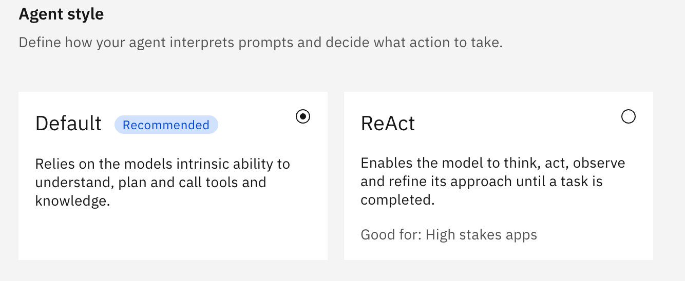


We are starting here so we can discuss the similarities and difference between default and react styles. 

PATH: 🚨 MAKE sure your terminal is in this directory `wxO_advanced_workshop/agent-styles-lab` so the command below is able to find the file path correctly. You'll get a error that the file doesn't exist if you are in the wrong directory. Use the `pwd` and `cd` terminal commands if needed to navigate to this directory.

```bash
orchestrate agents import -f src/agents/word-problem-solver.yaml
```

### Step 3: Let's start with agent `prototype phase`. 

Start your Developer Edition's chat feature. Even if it is already started you can run this command. 

```bash
orchestrate chat start
```
Now go to your web browser:

- If you are using macos then the browser automatically opens and you will see your Chat UI
- If you are using windows then you may need to manually open the web browser and create a new tab for `http://localhost:3000/chat-lite` to see the Chat UI

You should see this:

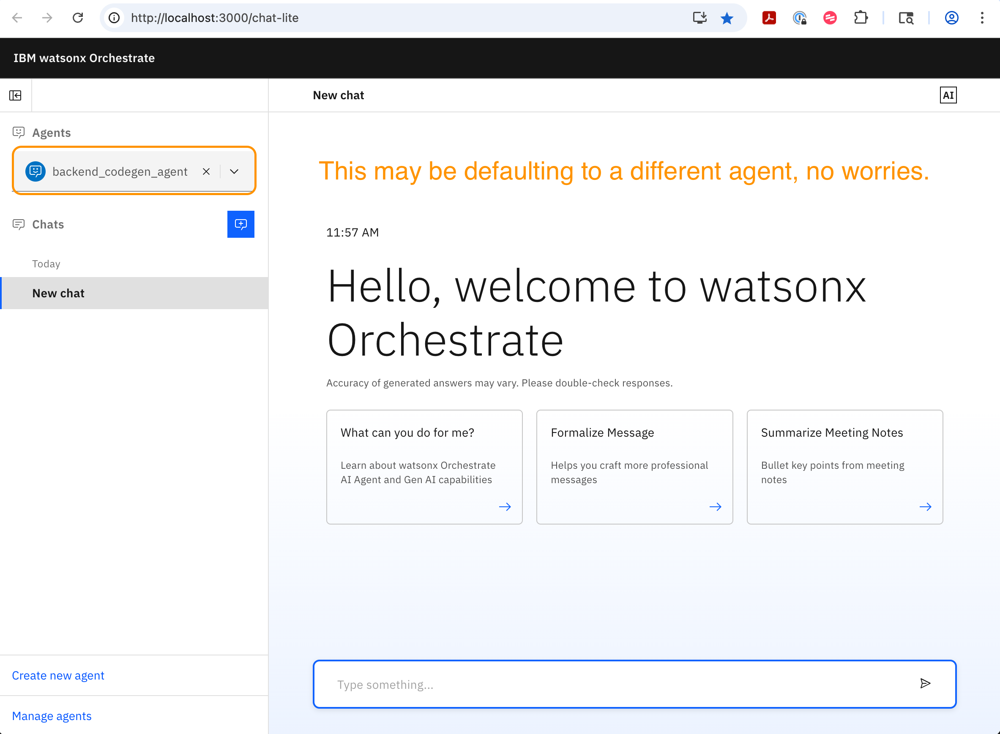

Now click the `Manage agents` button in the lower left corner. Then click the tile for the "Word problem solver" agent.

You should see this:

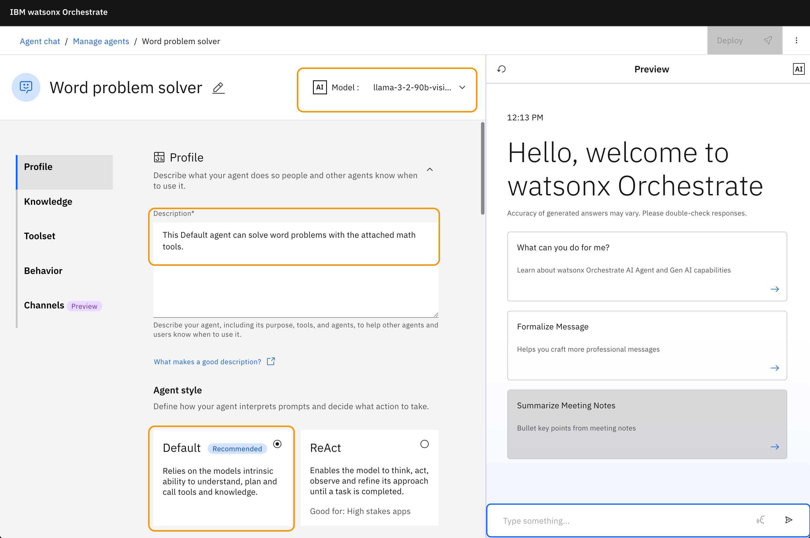

And scrolling down to the tools section of the agent you should see:

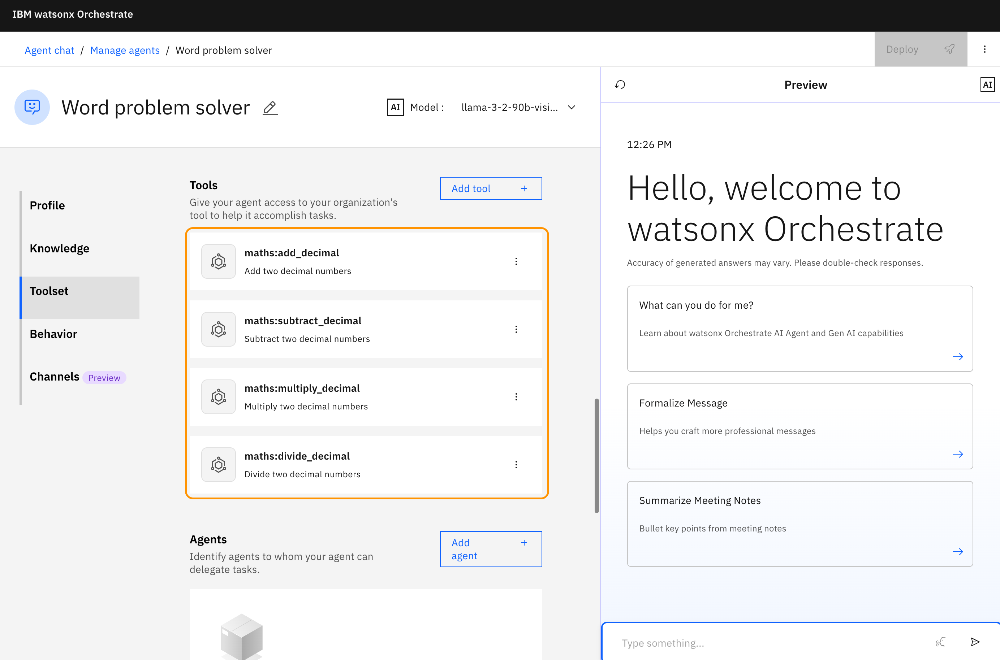


Now it is time to try our prompt:

```text
Using your tools solve this word problem. The school carnival is in town! Four friends—Alex, Ben, Chloe, and Dana—decide to pool their money to buy some treats and play games. First, they want to play the ring toss game, which costs $1.25 per turn. They each want one turn, so they buy 4 turns. Next, they head to the snack stand. They buy one giant pretzel to share for $3.80. Alex had $15.50 in his wallet, and he used it to pay for the game turns and the pretzel. After he gets his change, the four friends decide to split the remaining amount equally so they can each buy a snow cone later. How much money does each friend receive to spend on a snow cone?
```

Because agentic solutions are probablistic meaning they can vary from run to run as opposed to deterministic. For example python programs are deterministic, you alway get the same predictable result. Therefore, with our probablistic agentic agent you should see _something_ like this:

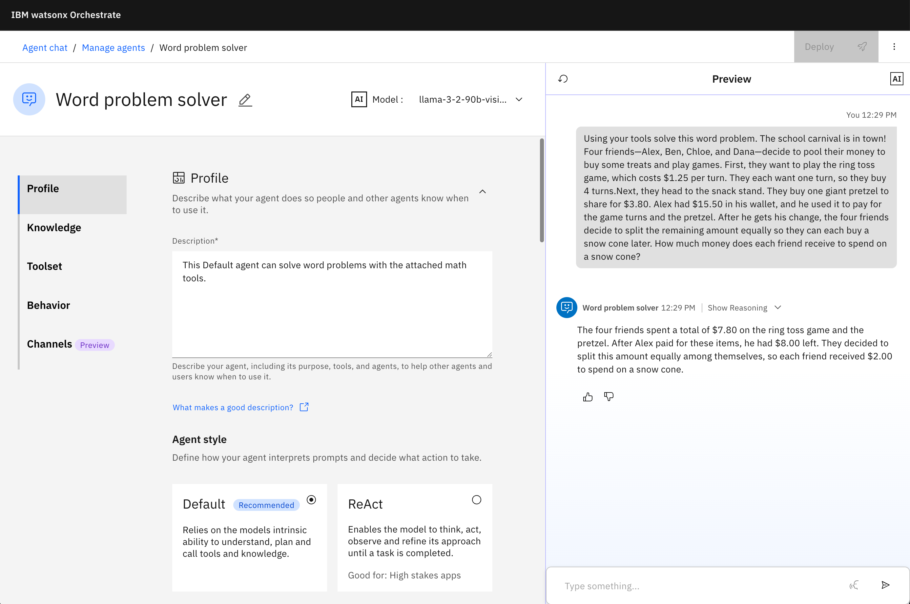

I like to call this the agent `prototype phase` 👩🏻‍💻 which just means that we are trying something out with little to no `instruction` parameter tuning. Remember we just need to get started and we picked a model and some tools so far. 

Overall you might see 4 steps in the `Show reasoning` dropdown, maybe less, because of several factors including:

- You are using a `Default` style agent
    - Default style agents rely on the model's __intrinsic__ ability to:
        - understand the word problem
        - plan a strategy to solve it 
        - call tools and knowledge based on it's plan
    - Thus the agent will rely on the ***llama-3-2-90b-vision-instruct*** model to understand, plan, call tools and knowledge.

If we look at those 4 steps (sometimes you may only get 1, 2, or 3 - remember probablistic!) then we can look at how they match up to how a human solved it as we examined earlier. So let's break the steps down and see what happened. 

Now it's time to open the `Show Reasoning` drop down. I know you are already curious!

These are what I got. 🚨 Yours may be different, remember probablistic, not deterministic. But the analysis I do below is what's important for you to learn how to do.

So let's examine what happened in each reasoning step. 

### Reasoning Step 1:

Tool: multiply_decimal

Input:
```json
{
  "a": "1",
  "b": "4"
}
```
Output:

```json
{
  "data": "meta=None content=[TextContent(type='text', text='4.0', annotations=None, meta=None)] structuredContent={'result': 4.0} isError=False"
}
```

**Daniel's interpretation:** That's telling me that the agent is trying figure out the part where we have 4 turns at the ring toss game that cost $1.25 each. The tool it calls `multiply_decimal` is the correct tool for this step, however, I can see that it is rounding the $1.25 down to 1. So the inputs are 1 and 4, Which gives it a solution of 4. 

For the output I can see that it is creating a kind of scratch pad for itself and storing the data from that step. Specifically, I can see that the following fields:

- `data` is the name of the object that the agent is storing into its scratch pad (i.e. memory).
- `meta` is none. This means that there is no meta data being collected but it can collect meta data. Not useful now but could be in some other project. 
- `content` is kinda like a function wrapped in an array where `TextContent` is the function and the parameters are `type` which is set to text, `text` set to 4.0, `annotations` is set to None, and `meta` is set to None. 
- `structuredContent` is a json object and has our `result` parameter set to 4.0
- `isError` is False, which means no errors occured with this tool call.

My take away:

- GOOD: The model correctly identified the first step in solving the word problem. Multiply game plays by cost. 
- GOOD: The model called the right tool to solve the first step in the word problem, which is multiplication of ring toss turns times cost of each turn.
- BAD: The Output has a `result` of 4.0 (should be 5)
- BAD: I need to address that the model likes to round down the inputs to the tool call. I can see that it sent 1 to the input of the `multiply_decimal` tool instead of 1.25 which is the cost of the turn. Maybe it just likes integers?

### Reasoning step 2:

Tool: add_decimals

Input:

```json
{
  "a": "4",
  "b": "3"
}
```

Output:

```json
{
  "data": "meta=None content=[TextContent(type='text', text='7.0', annotations=None, meta=None)] structuredContent={'result': 7.0} isError=False"
}
```
**Daniel's interpretation:** That's telling me that the agent is trying to figure out the cost of the ring toss games and the pretzel, which is the second step a human would do to solve this problem, so that is good news. It did select the right tool, `add_decimals` but again we are seeing that the model is rounding down the $3.80 cost of the pretzel to $3 and adding that to the result it got from the previous step $4.  

My take away:

- GOOD: It is keeping track of the previous step results.
- GOOD: So far it knows how to break the problem down correctly.
- GOOD: So far it is calling the right tools for the step it is trying to solve.
- BAD: Again, I need to address that the model likes to round down inputs to the tool call.

### Reasoning step 3:

Tool: subtract_decimal

Input:

```json
{
  "a": "15",
  "b": "7"
}
```

Output:

```json
{
  "data": "meta=None content=[TextContent(type='text', text='8.0', annotations=None, meta=None)] structuredContent={'result': 8.0} isError=False"
}
```

**Daniel's interpretation:** That's telling me that the agent is trying to figure out how much money is left after we subtract the costs so far for the games and pretzel from the amount of money Alex has in his wallet, $15.50. 

My take away:

- GOOD: So far it knows how to break the problem down correctly.
- GOOD: So far it is calling the right tools for the step it is trying to solve.
- BAD: Again, I need to address that the model likes to round down inputs to the tool call.
- BAD: The compounding errors from the rounding down is taking us off course to get an accurate answer. 

### Reasoning step 4:

Tool: divide_decimal

Input: 

```json
{
  "a": "8",
  "b": "4"
}
```

Output:

```json
{
  "data": "meta=None content=[TextContent(type='text', text='2.0', annotations=None, meta=None)] structuredContent={'result': 2.0} isError=False"
}
```

**Daniel's interpretation:** That's telling me that the agent is trying to determine how much money each person gets to buy a snow cone. 

My take away:

- GOOD: It knows how to break ALL the problem steps down correctly.
- GOOD: It is calling ALL the right tools for the step it is trying to solve.
- BAD: I need to address that the model likes to round down inputs to the tool call.
- BAD: The compounding errors from the rounding down is taking us off course to get an accurate answer. 

This analysis suggests that we can adding some instructions to see if that helps the model to stop rounding down the inputs to the tool calls. 

Let's do that now. 


### Step 4: Let's move to agent `debug phase` 

The first thing we can do is try some instructions like this to our agent's Behavior section:

`NOTE:` 🚨 Behavior is what the UI calls this section. In the yaml defintion of an agent the parameter is called instructions and it is currently empty.

```yaml
instructions: ''
```

Add this text to the Instructions text box of the agent from the UI. 

```txt
When calling tools check to make sure you are using the exact decimal value that the user gave you. Don't round the user values before using them in the tools. 
```

So it looks like this:

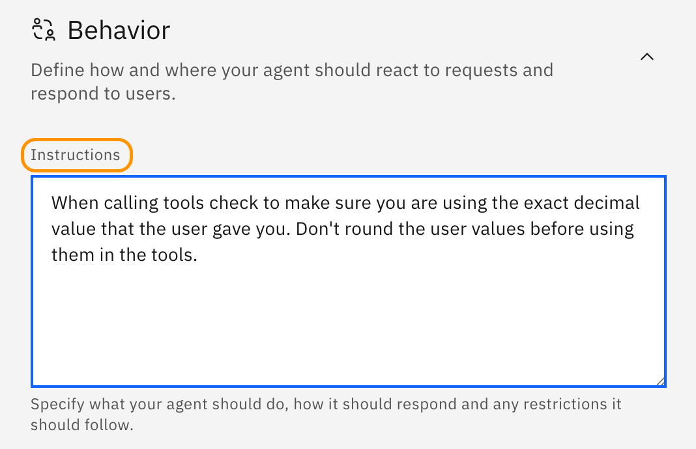


Now it's time to hit the button to reset the agent's chat Preview. 

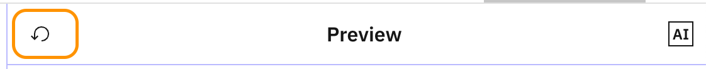

🧨 This ends the current chat session and starts a new one, which also resets the agent's memory. We don't want the agent to get confused, so ***reseting the chat session of the Preview is essential when making debugging changes***. 

Then try the prompt again. 

```txt
Using your tools solve this word problem. The school carnival is in town! Four friends—Alex, Ben, Chloe, and Dana—decide to pool their money to buy some treats and play games. First, they want to play the ring toss game, which costs $1.25 per turn. They each want one turn, so they buy 4 turns. Next, they head to the snack stand. They buy one giant pretzel to share for $3.80. Alex had $15.50 in his wallet, and he used it to pay for the game turns and the pretzel. After he gets his change, the four friends decide to split the remaining amount equally so they can each buy a snow cone later. How much money does each friend receive to spend on a snow cone?
```

Here is what I got:

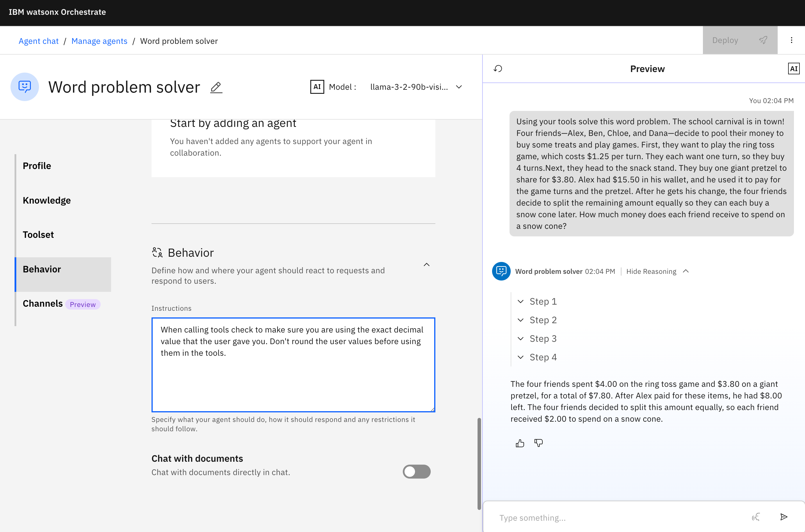

For me, this change didn't solve the problem and I suspect it is because we are using the Default style agent. I'll explain more in just a minute. However the Default style agent is really strong and a good place to start your `prototype phase` experiments. At this point I would typically try some more `instruction` variations to see if I can improve the accuracy of the numbers going into the tool calls. 

Right now the model is just using integers and we need to use decimals to improve the accuracy of the result. 
- So what's actually happening? 
- And why can't we make any changes that affect how the model puts inputs in to the tools? 

Remember that the `Default` agent style relys on the model's ***intrinsic*** ability to understand (doing a good job there), plan (doing a good job there too), and call tools and knowledge (could be better with regard to tool call inputs). 

Well something about this model's ***intrinsic*** ability is telling it to take rounding shortcuts. Which is not what we want. But that doesn't mean this model is hopeless for our purposes. Let's see what else we can do to tune it up. 

After exhausting your creativity on some more `instruction` variations it's probably time to take a bigger step and try moving to a `ReAct` style agent.


### Step 5: Continue with agent `debug phase`

We could switch the agent to a `ReAct` style agent by clicking the radio button on the Agent style section of the agent's Profile. But let's not. Here's why I think there is a better way when working with the ADK. 

`NOTE:` If you change the agent style to something else I've found that it's best to remove the Defaut style agent, then make the changes to the agent style (i.e. style: react) then reimport the agent to insure that the new agent style takes effect without any residual agent response caching from the previous style affecting the outputs. 

```bash
orchestrate agents remove -k native -n word_problem_solver
```

Now import the react version of the agent which already has the last instructions included. The only changes are the name, style, and description. The model is the same. The tools are the same.

```bash
orchestrate agents import -f src/agents/word-problem-solver-react.yaml
```

🚨 Now you need to refresh the Chat UI which is easy with the following steps. 

Click the Agent chat bread crumb link in the top left of the page. 

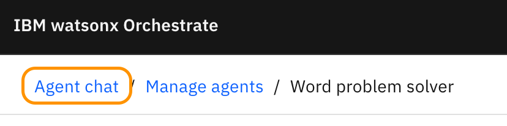

Then click the Manage agents bread crumb in the bottom left of the page. 

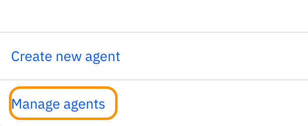


Then you should see your new agent tile called "Word problem solver react" and click on that to open the agent in preview mode. 

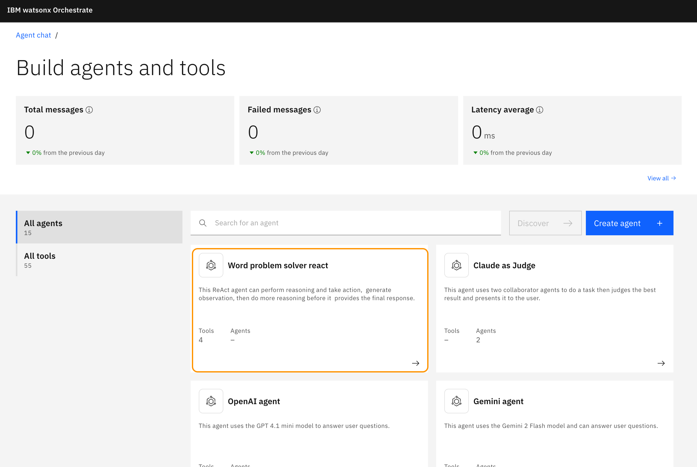


Now that we are back to a familiar place we can see that the agent's description has changed, the agent's style has changed to `ReAct` and finally we've kept the instructions changes we last did in in the Default agent debugging. I've done this for you to speed the lab along but you would do this when you are off on your own. 

Now the let's try our prompt again. 

```txt
Using your tools solve this word problem. The school carnival is in town! Four friends—Alex, Ben, Chloe, and Dana—decide to pool their money to buy some treats and play games. First, they want to play the ring toss game, which costs $1.25 per turn. They each want one turn, so they buy 4 turns. Next, they head to the snack stand. They buy one giant pretzel to share for $3.80. Alex had $15.50 in his wallet, and he used it to pay for the game turns and the pretzel. After he gets his change, the four friends decide to split the remaining amount equally so they can each buy a snow cone later. How much money does each friend receive to spend on a snow cone?
```

Here's what I got, remember probabalistic, your results may be a bit different:

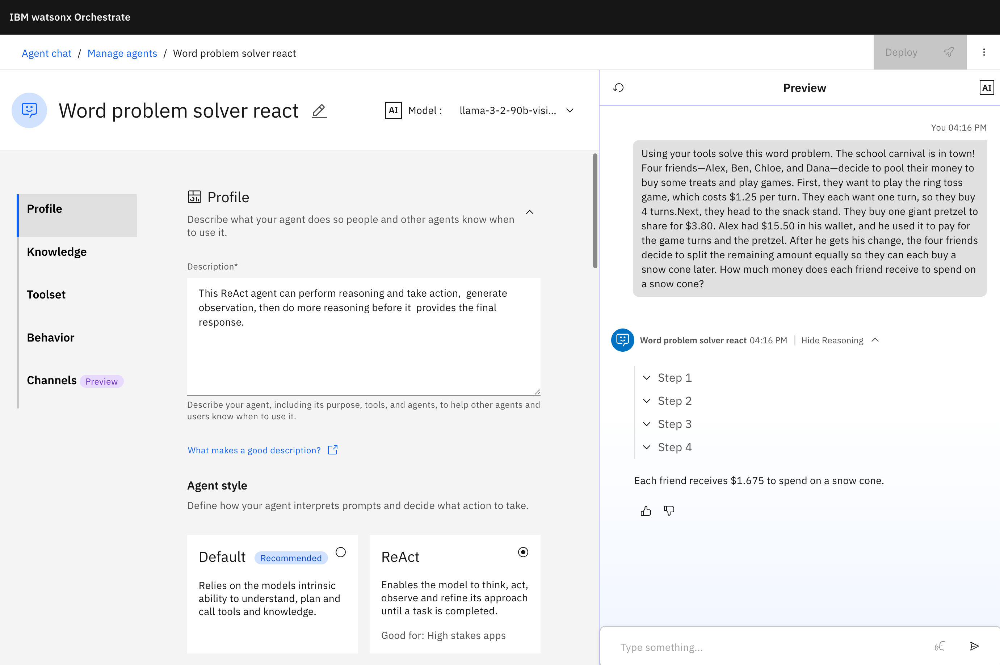

Now, when I prompted the react version of the agent I did get the correct answer. Let's examine the Reasoning steps that I got to see what is DIFFERENT about ReAct agents versus Default agents. And remember this is the SAME model `llama-3-2-90b-vision-instruct` so changing the agent style to `ReAct` did something significant to improve our agent's accuracy. 

🚨 These are the Reasons steps I got, remember probablistic, not deterministic so your results may be different. 

### Reasoning step 1:

Tool: multiply_decimal

Input:
```json
{
  "a": "1.25",
  "b": "4"
}
```

Output:
```txt
Observation: {'data': "meta=None content=[TextContent(type='text', text='5.0', annotations=None, meta=None)] structuredContent={'result': 5.0} isError=False"}
```
**Daniel's interpretation:** That's telling me that the agent is trying to figure how much money was spent on ring toss game. And this time with the same model we are getting decimals to the tool inputs. So it is taking a step like a tool call then observing it that is helping it solve the problem. If not then it can refine the approach. Apparently this model does have the ability to do decimals as inputs to tools but that is not its ***intrinsic*** behavior. 

**KEY DIFFERENCE of ReAct style:** The ability for the model to think, act, observe and refine its approach until a task is completed.  

ReAct style agents, have the ability to do an ***Observation*** after each step. This reflection of the step breaks it from following just its own ***intrinsic*** nature, reflect if it is following your instructions more closely after each step, and helps it to refine the result. This can take more time and tokens to achieve but the results can be very differentiated versus the Default style.

The Default style agent by contrast would make a plan and follow that plan mostly using its ***intrinsic*** behaviors, such as rounding to integers for faster math. Seemingly its ***intrisic*** abilities are more important than your instructions when doing agentic patterns like understand, plan, and call tools and knowledge. This can be great IF your model has the RIGHT ***intrinsic*** abilities you need to solve a problem. 

My take away:

- GOOD: It knows how to break down ALL the problem steps
- GOOD: It called the right tools to do the individual steps
- GOOD: It got the right result of 1.675
- BAD: The last step should really be a valid amount of money, in cents, which this is not. Obviously the people can't split a penny.  


### Reasoning step 2:

In my example this was the last Reasoning step but shows that model is successfully using decimal numbers in this step as well. 

Tool: add_decimals

Input:

```json
{
  "a": "5.0",
  "b": "3.80"
}
```
Output:

```json
Observation: {'data': "meta=None content=[TextContent(type='text', text='8.8', annotations=None, meta=None)] structuredContent={'result': 8.8} isError=False"}
```

### Reasoning steps 3-4 (finished as part of the answer)

Remember, probablistic, not deterministic. So your results may vary. 

My example just finished the last steps of subtraction and then finally division in as part of the answer like this:

```txt
Next, we subtract the total amount spent from Alex's initial amount: $15.50 - $8.80 = $6.70.

Finally, we divide the remaining amount by 4 to find the amount each friend receives: $6.70 / 4 = $1.675.
```

And produced the correct answer of:

```txt
So each friend receives $1.675 to spend on a snow cone.
```

If you didn't get the correct result you may need to do some additional tweaking on the instructions.

I did that and came up with a final version that I'm happy with `word-problem-solver-final.yaml`. So my agent is giving the right answer for the word problem prompt I have been using. At this point I would begin the `reliability phase` of development on this agent and start testing other prompts to see if they are also solved by the agent. 

## Step 5: Continue to agent `reliability phase`

Now let's load the final version of the agent. You will see that the only changes that I made were to the `instructions` parameter of the yaml file. Which changes to this:

```yaml
instructions: |
  IMPORTANT: Don't round the user values before using them in the tools.

  The final answer should be in a valid format, for example, if the 
  problem involves money then the answer should be in the form of 
  dollars and cents and rounded down to the nearest cent. 

  Examples: 500 or 500,00 or 500.00 = five hundred dollars and 
  no cents. 500,15 or 500.15 = five hundred dollars and fifteen cents.
```

Notice that I used a pipe | instead of a greater than > after the instructions to more precisely manage the line breaks in this parameter. Even white space can make a difference in the `debugging phase`!

Load the final agent with this command:

```bash
orchestrate agents import -f src/agents/word-problem-solver-final.yaml
```
and try it out with our prompt:

```txt
Using your tools solve this word problem. The school carnival is in town! Four friends—Alex, Ben, Chloe, and Dana—decide to pool their money to buy some treats and play games. First, they want to play the ring toss game, which costs $1.25 per turn. They each want one turn, so they buy 4 turns.Next, they head to the snack stand. They buy one giant pretzel to share for $3.80. Alex had $15.50 in his wallet, and he used it to pay for the game turns and the pretzel. After he gets his change, the four friends decide to split the remaining amount equally so they can each buy a snow cone later. How much money does each friend receive to spend on a snow cone?
```

Here's what I got on the final version, my `reliability phase` agent.

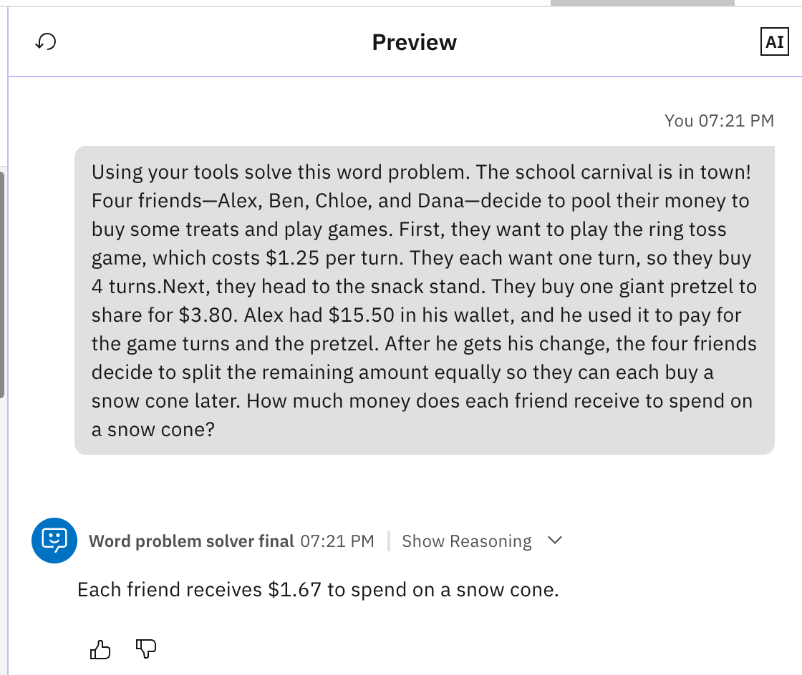

This is definitely an iterative process and can lead to the need to create a **supervisor agent** to classify different types of word problems and then send them to a subordinate collaborator agents which are tuned for solving different kinds of word problems. 

For example this agent only has simple addition, subtraction, multiplication, and division tools but what if the problem was about geometry? In that case it would fail. Take a deep breath and pat your back. You learned a lot of fundamental agentic techniques in this lab which will give you a solid foundation to try more advanced agentic patterns with watsonx Orchestrate. 

## What did you learn?

Hopefully you learned a lot about what it takes to go from an idea to a finished agent. Of course I hope that you will pick up on the methodology that I proposed for helping you to move through the process is phases:
- prototype phase
- debug phase
- reliability phase
- production phase (not in scope but discussed in the best practices below)

Additionally you learned about two of the three types of agent styles in watsonx Orchestrate.
- Default style agents that rely on the models ***intrinsic*** capabilities when understanding, planing, and calling tools and knowledge. 
- ReAct style agents that have an Observation after each step to help it to reflect on whether it is moving towards the correct answer and following your instructions. This can often be used to break some models out of their ***intrinsic*** abilities and follow your instructions more precisely. 

The last agent style is `planning` and it is something that you should now be able to explore more on your own. A key capability of the planning agent is that you have the HIGHEST level of control on the formation of the response that the agent returns to the user. 

## Congratulation! You finished agent-style-lab!

### Some agent style and instruction tuning best practices

LLM's are by nature probablistic engines which can lead to some frustration in the agent style and instruction tuning process. I have a few best practices to help you keep your sanity when moving from the `prototype stage` to the `debug phase` to the `reliability phase` and then into `production phase`.

These phases are my creation from working with the agents in watsonx Orchestrate. These are not official IBM phases. I couldn't find any official methodology so I invented this one to help me get my arms around the big picture. 

- `prototype phase` - In this phase the main goal is to just get started with a default agent style and select a model. I like to see what I can do to tune the smallest model first and get into the `debug phase`. With more experience you will know what models are good starting points for your ideas. 

- `debug phase` - In this phase it's important to make sure that your LLM is properly understanding how to solve the problem and calling the right tools in the right order. That is half the battle. You saw how to use the `Show reasoning` tools to help you understand what's happening. Of course you should already know how to solve the problem yourself just as we did in the beginning of this lab. So you know if you are on course or not. 
    - Don't forget about `Langfuse`! This can be a critical tool to help you understand what is happening in your agent.
    - Don't forget about `orchestrate server logs` command to see what the ADK server is doing when you run an agent. 
    - Sometimes a larger parameter model (for example `llama-3-405b-instruct` or `claude-opus4` etc) can just do it better with less manual tuning of the agent style and instructions. Just remember their will always be trade offs like cost or speed to consider. 

- `reliability phase` - In this phase your agent is now tuned to successfully solve at least one example of the kinds of problems you want it to solve. Now you need to try other examples and see if that requires modifications to the agent style and instructions or a different agentic pattern like a classifier that routes specific problem types to specialized agents. 

- `production phase` - Though we can't cover this in the lab, the production phase would include baselining your agent and it's responses to a set of examples so that you can create governance metrics for the agent in production to insure it is operating at the expected levels of accuracy, performance, and meets all compliance requirements like filtering PII, bais metrics, etc. 

### Working with the ADK

- When you make minor changes to your agent like update instructions then it's often ok to just use the reset agent button in the preview to try out the new changes. The reset agent Preview button looks like this:


- When you make major changes to your agent like changing agent style from Default to ReAct, then you SHOULD remove the current agent, make the changes, and then reload the agent. I find this breaks the connection to cached information that wxO uses when making calls and giving responses. Specifically it breaks the ties to previous runs of the agent. 

- When you find yourself in a situation where nothing seems to be changing with your modifications it can be helpful to use the command to stop the server, which also stops the Chat UI, then restart the server. 


## Cleanup

```bash
orchestrate agents remove -k native -n word_problem_solver
```

```bash
orchestrate agents remove -k native -n word_problem_solver_react
```

```bash
orchestrate agents remove -k native -n word_problem_solver_final
```

```bash
orchestrate toolkits remove -n maths
```


