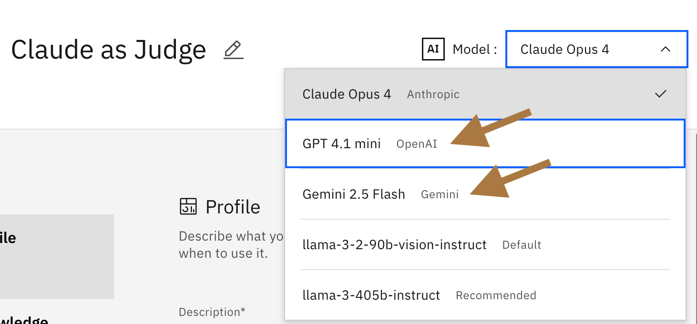

# Step 2: Load the models

## Setup
 
There are two ways to get models into watsonx Orchestrate via the ADK
Let's use the first method because it allows for precise control of the imported model's attributes. Additionally, unlike the orchestrate models add command it allows the use of tags that will help your model to be easily identified in the UI like this:



Note that the `--app-id` is **required** when you add models with a yaml file. So do this **AFTER** you add the connections which set the `--app-id` you need.

```bash
orchestrate models import --file src/models/claude.yaml --app-id claude_creds

orchestrate models import --file src/models/gemini.yaml --app-id gemini_creds

orchestrate models import --file src/models/openai.yaml --app-id openai_creds

```

## Cleanup

The `--name` flag is all that is needed to remove the model but you need to know the name of the model so `orchestrate model list` is a fast way to check the model names.

```bash
orchestrate models remove --name virtual-model/anthropic/claude-opus-4-20250514

orchestrate models remove --name virtual-model/google/gemini-2.5-flash 

orchestrate models remove --name virtual-model/openai/gpt-4.1-mini 
```

