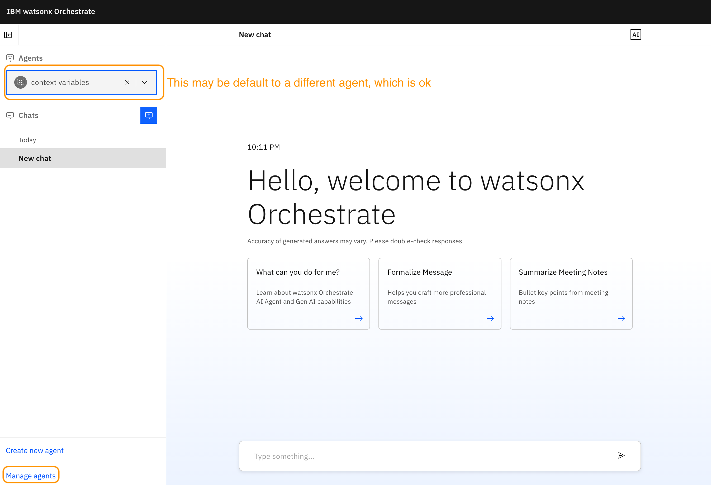
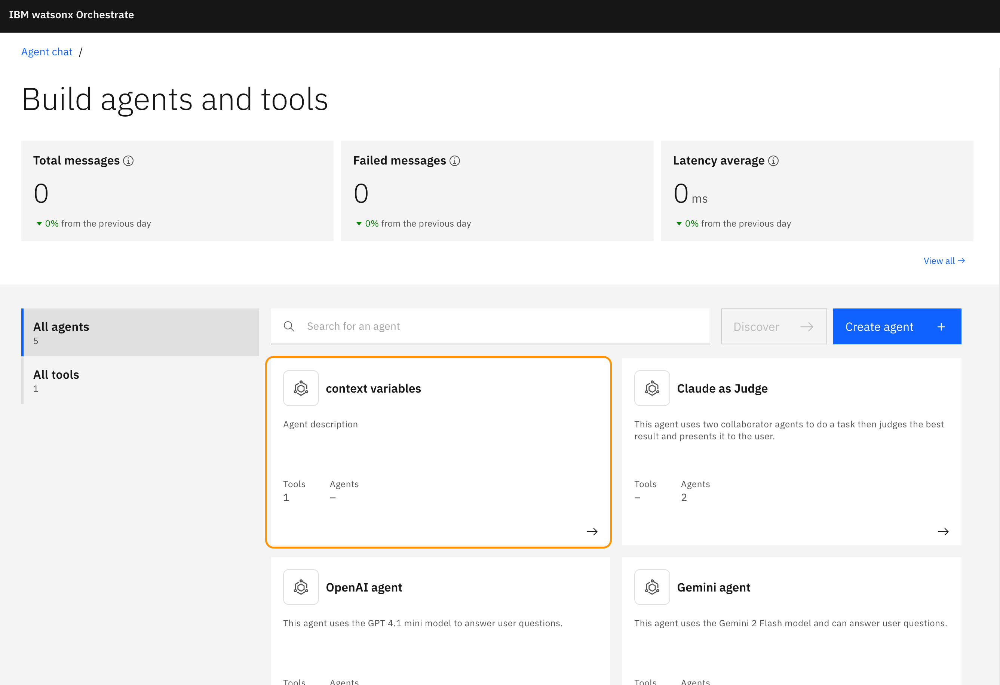
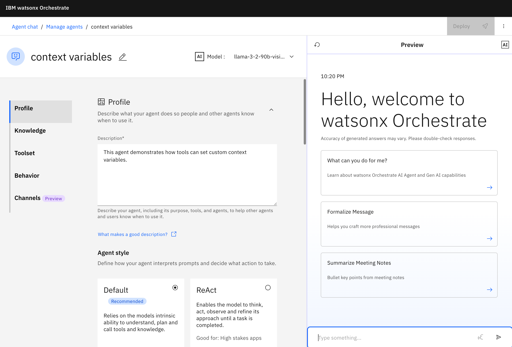
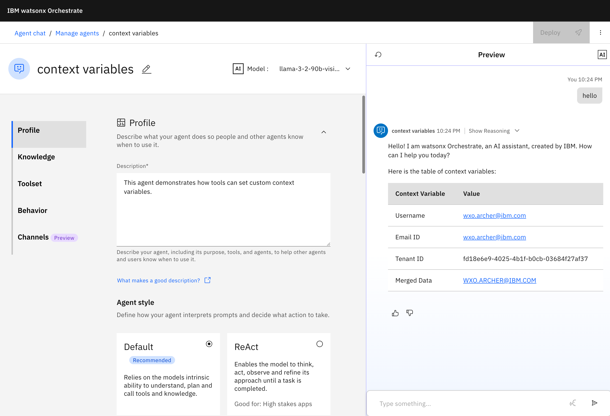

# Context variables labs

## What you will learn 

- Purpose and use of the agent's context variables capability.
- Some built in context variables that are always avaiable.
- How to define custom context variables for an agent. 
- How to use a python tool to set a custom context variable.

### What are context variables?

Think about context variables like any other variable. It is a placeholder for information that you can use to:
- Display the information in the context variable as part of the agent's output.
- Use it as input to a tool. 
- Use is as output from a tool to set a context variable.

Their are several built in context variables that are always available, if defined, in an agent. They are:
- ***wxo_user_name*** (typically, the email address of a member of the wxO tenant)
- ***wxo_email_id*** (the member's email address)
- ***wxo_tenant_id*** (the unique tenant id of the wxO instance)

You can define as many custom context variables as you want for an agent. This useful when you need to pass a context variable from an agent to a tool and then the tool will return values for the custom context variables. 

This is what we will be doing in the lab today. You will pass in the built in context variable of {wxo_user_name} to the tool called make_uppercase which will do its namesake and turn the wxo_user_name value into all CAPS and return it as the custom context variable called {merged_data}

### Step 1: Import the `make_uppercase.py` python tool

For any python tool in watsonx Orchestrate you will need to have both the python tool file **context_variable_tool.py** and the associated **requirements.txt** files.

Since the tool is a dependency of the agent we need to install it first.

PATH: 🚨 MAKE sure your terminal is in this directory `wxO_advanced_workshop/context-variables-lab` so the command below is able to find the file path correctly. You'll get a error that the file doesn't exist if you are in the wrong directory. Use the `pwd` and `cd` terminal commands if needed to navigate to this directory.

```bash
orchestrate tools import -k python -f src/tools/make_uppercase.py -r src/tools/requirements.txt
```

### Step 2: Import the `context-variables.yaml` agent

The agent which has the following instructions:

```yaml
instructions: 'When the user says "hello" you call the make_uppercase tool 
  and provide it with the context variables {wxo_user_name}. 
  Finally provide the user with a table of the following context variables: 
  Username: {wxo_user_name} and Email ID: {wxo_email_id} and 
  Tenant ID: {wxo_tenant_id} and Merged Data: {merged_data}'
```

Import the `context-variables.yaml` agent with this command: 

```bash
orchestrate agents import -f src/agents/context-variables.yaml
```

### Step 3. Test the context_variables agent in the ADK Chat UI

If the Chat UI is not already turned on then you can use this command to get it running:

```bash
orchestrate chat start
```

Now go to your web browser:

- If you are using macos then the browser automatically opens and you will see your Chat UI
- If you are using windows then you may need to manually open the web browser and create a new tab for `http://localhost:3000/chat-lite` to see the Chat UI

You should see this:



Then click the Manage agents link in the lower left of the screen.

You should now see the agent tile called context variables and click it to open the agent.



Now you are in the editing window for the context variables agent. 




### Step 4. Test the agent with the trigger word `hello`

In the preview pane of the window type the trigger word for the agent which is `hello` to see it display the results of the tool call. 

```text
hello
```

Your response should look something like this:



#### Let's examine what happened to produce this output

The trigger word kicked off the tool call and passed the built-in context variable wxo_user_name to the python tool called make_uppercase. Then the make_uppercase tool took the wxo_user_name and made is ALL CAPS and returned it as the merged_data context variable. 

Here's the agent instructions again for reference:

```yaml
instructions: 'When the user says "hello" you call the make_uppercase tool 
  and provide it with the context variables {wxo_user_name}. 
  Finally provide the user with a table of the following context variables: 
  Username: {wxo_user_name} and Email ID: {wxo_email_id} and 
  Tenant ID: {wxo_tenant_id} and Merged Data: {merged_data}'
```

Here is the key part of the python tool make_uppercase for reference:

```python
    #functionality of the tool
    merged_data = input.upper()
    
    # This line sets the context variable merged_data in the agent.
    return f"merged_data={merged_data}" 
```

### What you learned

While this is a very simple example of setting custom context variables it shows you the technique you would use to in your own agent experiements. 

You can learn more about context variable from the [documentation](https://developer.watson-orchestrate.ibm.com/agents/build_agent#providing-access-to-context-variables)


### Cleanup
It is always a good idea to clean up your labs so that your environment stays clutter free and ready to use for the next experiement or lab you do. 

Remove the "context variables" agent with this command

```bash
orchestrate agents remove -k native -n context_variables
```

Remove the "context_variables_tool" tool with this command

```bash
orchestrate tools remove -n make_uppercase
```