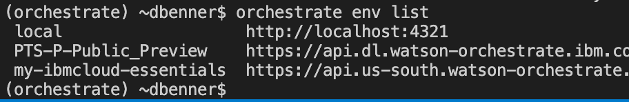
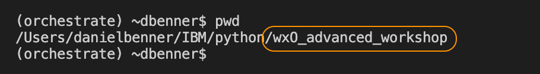
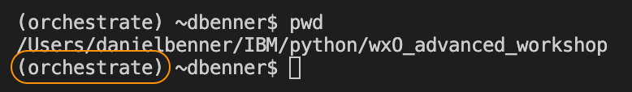
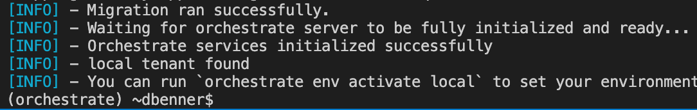
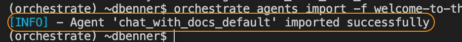
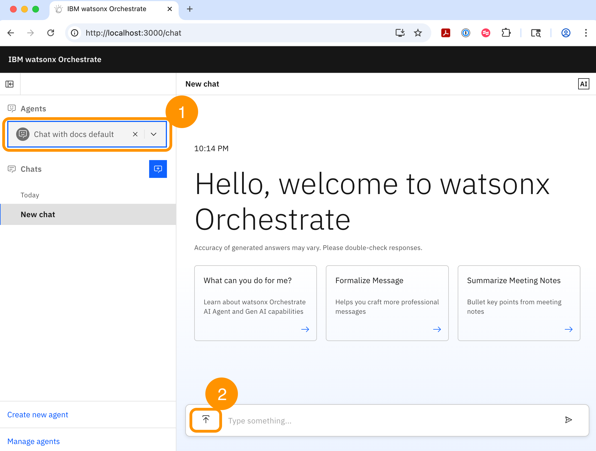
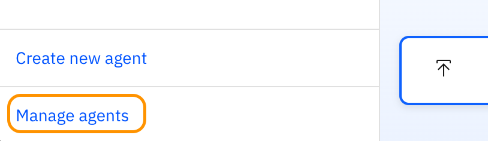
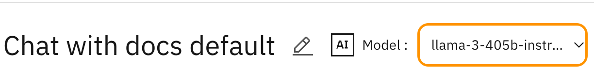
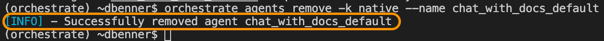

# Welcome to the ADK lab
## What you will learn
In this lab you will learn about using the ADK commands to manage the Developer Edition such as import an agent to test out locally on your laptop. Let me unpack the two big concepts in that sentence a little bit to clarify. 

***watsonx Orchestrate ADK*** is a CLI application built with python that can be used to interact with watsonx Orchestrate instances called environments and abbreviated as env in the commands. We'll learn more about configuring environments with .env files as well.

`NOTE:` If you are targeting a SaaS or on-premises instance of watsonx Orchestrate (wxO) then you don't need to run the local server, which is the wxO Developer Edition. You would do this if you just wanted to push your agents and supporting resources from code on your laptop to that remote instance. It is also how you might incorporate the ADK into a devops pipeline. 

***watsonx Orchestrate Developer Edition*** is a set of docker images that are pulled together and integrated with docker compose to provide a local watsonx Orchestrate instance on your laptop that includes a UI which replicates the  Chat functionality on SaaS instances of wxO. You can use it to gain more control when developing and debugging your agents.

#### Some things to know about the watsonx Orchestrate Developer Edition
- It is local server running on your computer that provides a dedicated development environment
- It runs on http://localhost:4321 which is the API endpoint of the local server
- It has a UI on http://localhost:3000/chat-lite which is the Chat UI to test agents
- You start it with this command `orchestrate server start -e <env_file>`
- You stop it with this command `orchestrate server stop`
- You can see what environments are configured and which is the active one (i.e. ADK commands target the active environment only) with this command `orchestrate env list`
- To start the Chat UI use `orchestrate chat start` which only works AFTER the server is started.
- To stop the Chat UI use `orchestrate chat stop` 


Example of `orchestrate env list` output.

Notice in the image I am connected to a:
- A local environment `localhost:4321`
- An AWS environment `api.dl.watson-orchestrate.ibm.com`, 
- And an IBM Cloud environment `api.us-south.watson-orchestrate.cloud.ibm.com` and yes different regions in IBM Cloud would have different api endpoints for their SaaS instances. 

But wait there's more! All of that functionality in the server can drive a UI for you to test out your agents and tools. 

- The local environment UI is started with this command `orchestrate chat start`
- And stoped with this command `orchestrate chat stop`
 

## Getting started

If you have the Developer Edition installed on your laptop already then you were successful in creating the .env file that is the <env_file> part of the server start command `orchestrate server start -e <env_file> but just in case I want to review how to make it from scratch if you need to do it again. 

```bash
WO_DEVELOPER_EDITION_SOURCE=orchestrate
WO_INSTANCE=<service_instance_url>
WO_API_KEY=<wxo_api_key>
```

If you need to review how to do this please check out this [guide](https://developer.watson-orchestrate.ibm.com/developer_edition/wxOde_setup)

Let's start up the Developer Edition server now. 

Step 1: Make sure you are in the root (i.e. top level) of the wxO_advanced_workshop folder. That's easy to do with this command `pwd` and it should end with /wxO_advanced_workshop like this image below:



If you need are not in the right directory then you will need to naviagate there using the command for change directory `cd` and using `cd ..` will move you up one directory or `cd <some folder>` will move you down into that folder. 

Step 2: Ensure your virtual environment is activitated. Use the `source .venv/bin/activate` command if you don't see (orchestrate) in front of your command line prompt in the terminal window of VS Code. Like the image below



Step 3: Make sure your .env file is in the root of the wxO_advanced_workshop folder. It is a hidden file but VS Code shows all hidden files so you will be able to see it. 

Step 4: Start the Developer Edition server with `orchestrate server start -e .env`

If successful you will see in the INFO messages on your terminal that things went well like this:



`NOTE:` If this is the first time you are starting the developer edition server it may have to download a lot of container images. Be patient and if it throws and error retry the start command. 

`NOTE:` If your command fails read the error message and see if it is telling you what you need to correct. If that doesn't fix the issue the notify a workshop proctor for some assistance. 

Step 5: In the VS Code EXPLORER pane click on the file called `chat_with_docs_default.yaml` which in this path `wxO_advanced_workshop/welcome-to-the-adk/src/agents/chat_with_docs_default.yaml`

Take a look at what an agent looks like in `yaml` format. This is one of three different formats that the ADK can process to load an agent into an environment. The others are `json` and `python` formats. But we will be using the `yaml` format because it is easy for humans to read. 🤓

When we use yaml to define agents they MUST have some minimum elements to them. Here's what those are:

```yaml
spec_version: v1
kind: native  # or external but requires addition specification of provider in yaml
name: agent_name # internal name with no spaces or special characters
display_name: Agent name here # The displayed name of the agent in the UI
llm: watsonx/meta-llama/llama-3-2-90b-vision-instruct # or another LLM 
style: default # or react or planner. Agents of type planner are only able to be specified via the ADK.
description: >
    A description of what the agent should be used for when used as a collaborator.
instructions: >
    These instructions control the behavior of the agent and provide 
    context for how to use its tools and agents.
```

And here's what the chat_with_docs_default.yaml looks like:

```yaml
spec_version: v1
kind: native
style: default
name: chat_with_docs_native
display_name: Chat with docs native
llm: watsonx/meta-llama/llama-3-2-90b-vision-instruct
description:  'This agent allows a user to upload documents and then ask questions about that document in the same chat conversation.'
instructions: 'When a user uploads a document your role is to answer user questions from that document. Unless you are specifically instructed otherwise use the document that the use has uploaded to answer any user questions. If there is not an answer to the question in the uploaded document then tell the user that you did not find the answer in the document that was uploaded.'
collaborators: []
tools: []
chat_with_docs:
  enabled: true
  citations:
    citations_shown: -1
```

Step 6: Let's load this agent into our local server with this command `orchestrate agents import -f welcome-to-the-adk/src/agents/chat_with_docs_default.yaml`

If you are successful you will see:



If you are not successful then read the error message and see if you can fix the issue. 

Step 7: Now let's start the Chat UI so we can play with our agent. Use `orchestrate chat start` and a new browser window and/or tab will appear with the Chat UI. Like this:



Circle 1: Use this drop down to select your Chat with docs default agent

Circle 2: Notice that we now have the ability to upload a document to chat with via this icon. 

#### You can read more about the chat with documents feature [here](https://developer.watson-orchestrate.ibm.com/agents/build_agent#chat-with-documents).

Step 8: Use the upload icon and navigate to the sample-resume.pdf in the resources folder. Here's the path `wxO_advanced_workshop/welcome_to_the_adk/resources/sample-resume.pdf`

And try this prompt, "What are the skills listed on this resume?"

Step 9: Let's try changing the LLM and see if we get a different result. Use the Manage agents button at the bottom right of the Chat UI.



Step 10: Click the tile for your agent and use the AI Model drop down to select the llama-3-405b-instruct model.



This time stay in the manage agent screen (or click Agent Chat in the upper left) and retest the agent with the new model but same prompt.

Try "What are the skills listed on this resume?"

Did you get a different result? Better? Worse? 

This is a foundational aspect of building agents; namely the model does matter. You will often want to try out different models to see if you can tweak the results to find a model that works for your use case, which might be scraping skills off a resume or something totally different. 

Step 11: Let's now remove this agent from our local environment to finish off the lab. Use `orchestrate agents remove -k native --name chat_with_docs_default`

If successful you will see:



Notice that to remove an agent we need to specify some different things than what we used to import it. 

`-k native` specifies that we want to remove a `native` agent (as opposed to an `external` or `assistant` agent kind)

`--name chat_with_docs_default` is the `name:` of the agent, not the `display_name:` of the agent in the yaml file. 

## Congratulations! You completed the Welcome to the ADK lab. 

### If you noticed the chat_with_docs_react.yaml agent and you are curious
Then try importing it using the skills you just learned. Then try a more advanced prompt like, "First summarize all the skills and experience in this resume then classify it as a modern or legacy skill and finally display it as a table."

Things to consider:
- Did the style of agent as react matter for this type of prompt?
- Did you try different LLMs to see if the results changed for the better/worse?

Hint: We'll discuss agent styles in a different presentation but no we didn't really use the full react capability with this chat with documents sample because we are only using one built-in tool, chat with documents. 

## Some more about ADK and Developer Edition

#### You can explore all the ADK documentation [here](https://developer.watson-orchestrate.ibm.com/).


The Developer Edition is constantly being updated with the same code base as the SaaS instances. To stay current with the latest version check out the [What's new](https://developer.watson-orchestrate.ibm.com/release/release) in the ADK documentation. 

To stay current with the latest features of the ADK and Developer Edition you need to update `ibm-watsonx-orchestrate` python package.

Use this command to update the python package:

```bash
uv update ibm-watsonx-orchestrate
```
or if you are NOT using UV in your project then 

```bash
pip install --upgrade ibm-watsonx-orchestrate
```
